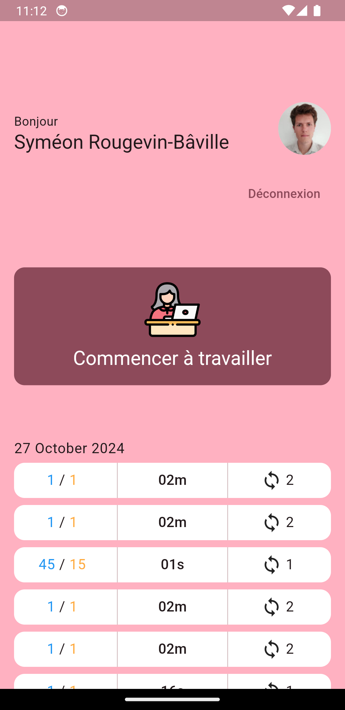
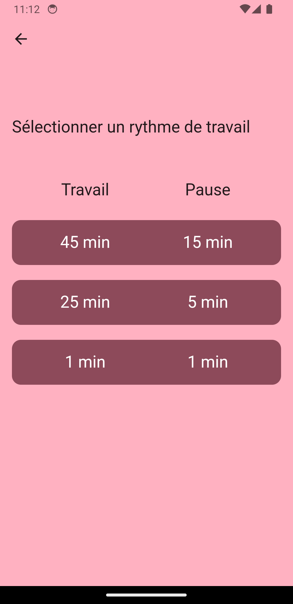
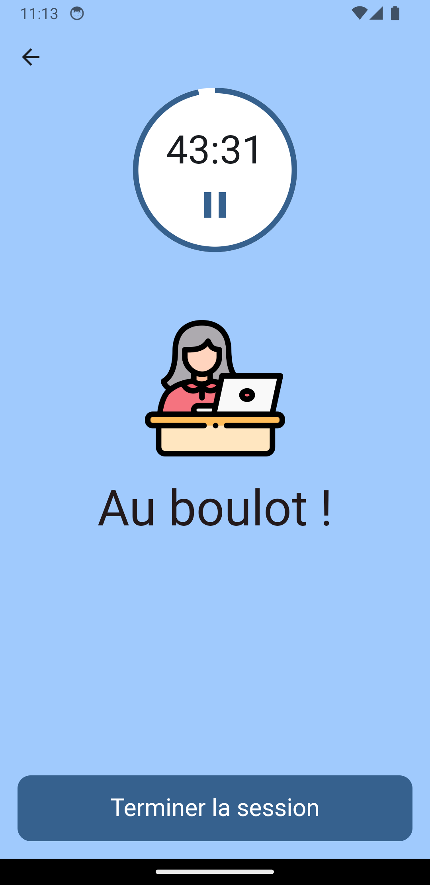
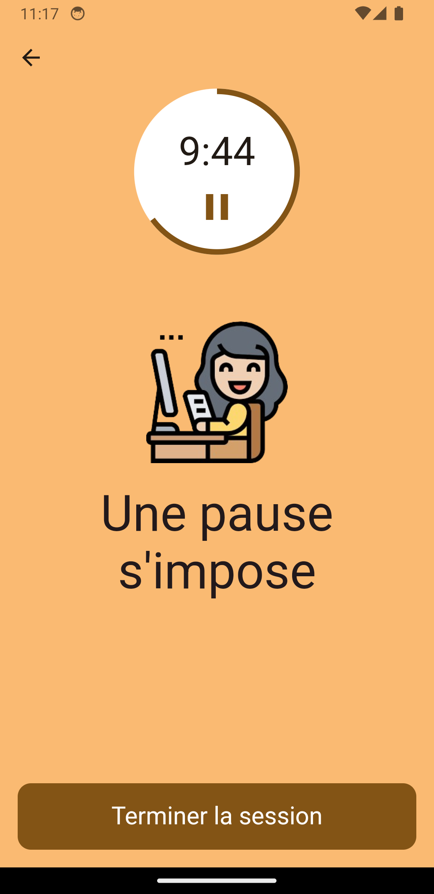

<div align="center">


<h3 align="center">Pomodoro - Flutter</h3>

<p align="center">
    Un timer pomodoro créé en Flutter 🪶
</p>
</div>

## A propos du projet

Pomodoro est une application qui propose un minuteur avec plusieurs modes pour travailler selon la technique Pomodoro 🍅. Ce projet a été développé dans le cadre d'un cours de développement mobile multiplateforme 📱.

<div style="display: flex">




</div>

### Fonctionnalitées:

- 3 modes (Temps de travail / Temps de repos) :
  - 45 min / 15 min 🕒
  - 25 min / 5 min ⏳
  - 1 min / 1 min ⏱️
- Le minuteur fonctionne en arrière-plan, vous permettant d'utiliser d'autres applications pendant son activation 🕒.
- Possibilité d'arrêter ou de mettre le minuteur en pause ⏸️.
- Une notification avec un son personnalisé 🎶 vous alerte lorsque le minuteur est terminé, vous rappelant de passer entre les modes de travail et de repos 🔔.
- Connectez-vous avec votre compte Google pour accéder à votre historique de sessions 🗓️.

⚠️ Si vous n'êtes pas connecté ou si vous fermez l'application, la session ne sera pas enregistrée dans l'historique.

### Compatibilitées

- **Android** 📱

  - Version minimale requise : `Android 6.0` (niveau API 23).

- **iOS** 🍏

  - Version minimale requise : `iOS 13`.

- **Web** 🌐 : `Non pris en charge`.

### Technologies Utilisées dans Pomodoro 🚀

#### Frameworks 🧩

- ![Flutter][React-Native.js]

#### Langages de Développement 💻

- ![Dart][JavaScript.js]

#### Base de Données 🗄️

- 

#### Authentification 🔐

- 

---

## Mise en Route

Avant d'utiliser le code du projet, assurez-vous d'avoir les prérequis corrects ✅.

### Prérequis

- Un emulateur android ou iOS ou un téléphone relié par câble à votre ordinateur
- Fichier de configuration Firebase pour Android : `google-services.json`
- Fichier de configuration Firebase pour iOS : `GoogleService-Info.plist`
- Fichier de configuration Firebase global : `firebase_options.dart`

### Installation & Exécutiuon

Veuillez suivre attentivement le guide d'installation 📝 pour éviter des problèmes au démarrage 🚀.

1. Clonez le dépôt
   ```sh
   git clone git@github.com:symeonrb/pomodoro_flutter.git
   ```
2. Placez le fichier `google-services.json` dans `/android/app`.
3. Placez le fichier `GoogleService-Info.plist` dans `/iOS/Runner`.
4. Placez le fichier `firebase_options.dart` dans `/lib`.
5. Lancez
   ```sh
   flutter run
   ```

## Contributeurs

Les contributeurs de ce projet sont :

- Maël Mainsard
- Syméon Rougevin-Bâville
